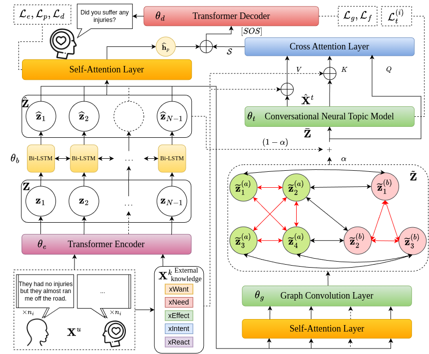

# Multi-turn-Dialogue-Response



## Install requirements.txt

```bash
conda install --yes --file requirements.txt
```

## Pre-processing

* Download  [**Pretrained GloVe Embeddings**](http://nlp.stanford.edu/data/glove.6B.zip) and save it in `/vectors`.
* The preprocessed dataset is saved as `/data/ED/dataset_preproc.p`. If you want to create the dataset yourself or change the knowledge types generated by COMET, delete this file, download the [COMET checkpoint](https://github.com/allenai/comet-atomic-2020) and place it in `/data/ED/Comet`. The preprocessed dataset would be generated after the training script. Here, we use BART, since the GPT-2 version can not be used.

## Dataset

In this study we use two different dataset. In this repository, we set the config and mapping to EmpatheticDialogues.

- [EmpatheticDialogues](https://github.com/facebookresearch/EmpatheticDialogues)
- [DailyDialog](http://yanran.li/dailydialog)

### Data Resource

- [EmpatheticDialogues](https://drive.google.com/drive/folders/1UiEr4ug0nc4uJQYvvO2U4MHt3bhf66VW?usp=sharing)
- [DailyDialog](https://drive.google.com/drive/folders/1nUBCQjNjlNjqLZykrYoiKxDAKUVYQApK?usp=sharing)

### Data Structure

The `data` folder is organized as follows:

```
data
|--- ED
|    |--- Comet
|    |--- emp.pkl
|    |--- train.csv
|    |--- valid.csv
|    |--- test.csv
|    
|--- DD
|    |--- Comet
|    |--- dd.pkl
|    |--- train.csv
|    |--- valid.csv
|    |--- test.csv
```

### Directory and File Descriptions

- **`data/`**: The root directory containing all data files.

  - **`ED/`**: This directory contains files for the "EmpatheticDialogues" dataset.
  
    - **`Comet/`**: A subdirectory containing the "Comet" package used to generate common-sense knowledge.
    
    - **`emp.pkl`**: A pickle file containing topic appearance probabilities for the "EmpatheticDialogues" dataset.
    
    - **`train.csv`**: The training data file for the "EmpatheticDialogues" dataset.
    
    - **`valid.csv`**: The validation data file for the "EmpatheticDialogues" dataset.
    
    - **`test.csv`**: The testing data file for the "EmpatheticDialogues" dataset.
    
  - **`DD/`**: This directory contains files for the "DailyDialog" dataset.
  
    - **`Comet/`**: A subdirectory containing the "Comet" package used to generate common-sense knowledge.
    
    - **`dd.pkl`**: A pickle file containing topic appearance probabilities for the "DailyDialog" dataset.
    
    - **`train.csv`**: The training data file for the "DailyDialog" dataset.
    
    - **`valid.csv`**: The validation data file for the "DailyDialog" dataset.
    
    - **`test.csv`**: The testing data file for the "DailyDialog" dataset.

## Training

```bash
python main.py --cuda --save_path save/your_dir
```

## Testing

```bash
python main.py --cuda --test --save_path save/your_dir --model_path save/dir_save/KITM_XXXX.XXX
```

Please be free to contact with us via present90308.ee11@nycu.edu.tw
